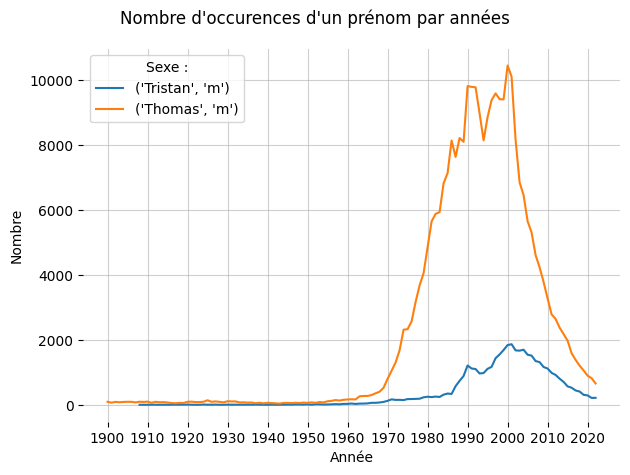
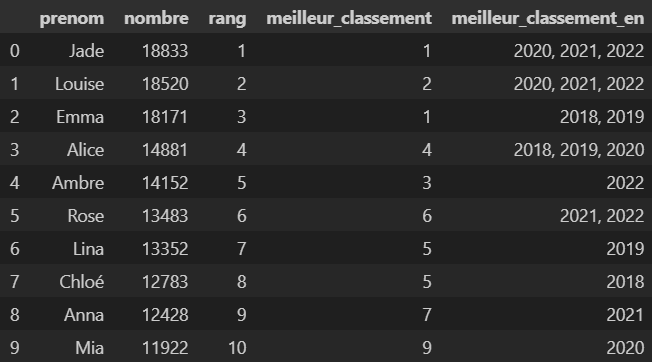

# Analyse des prénoms en France entre 1900 et 2022

Tous les ans, l'INSEE met à disposition un fichier contenant les prénoms attribués en France depuis 1900 jusqu'au jour de la mise à jour.

> &#9888; L'ensemble des manipulations, analyses et graphiques sont réalisés grâce à **Pandas** et **Matplotlib**.

Le *notebook*  `analyse-prenoms-france-1900-2022.ipynb` contient :
* des informations sur la constitution du fichier et notamment sur les prénoms retenus ;
* l'importation et le prétraitement des données ;
* une rapide analyse descriptive et exploratoire des données ;
* la reproduction des outils proposés sur le site de l'INSEE : classement et graphique ;
* quelques recherches pour établir une liste réduite de prénoms par genre.

## Reproduction des outils de l'INSEE

