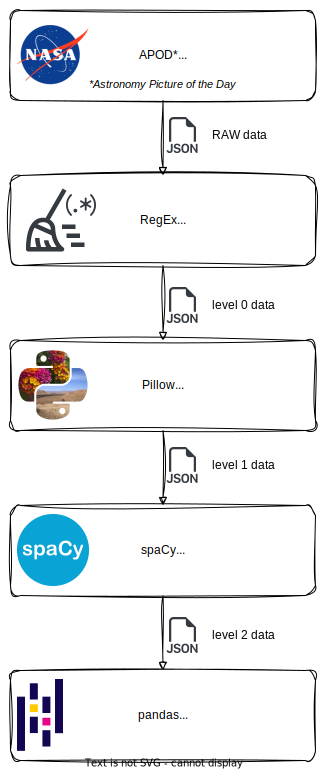

# NASA Astronomy Picture of the Day (APOD)<br>Création d'un jeu de données


## &#128301; Présentation

Chaque jour depuis juin 1995, sur son site [*Astronomy Picture of the Day*](https://apod.nasa.gov/apod/), la NASA présente une image différente de notre univers accompagnée d'une brève explication rédigée par un astronome professionnel.

Les métadonnées associées à chaque image sont accessibles *via* l'API dédiée mise à diposition sur le portail [NASA Open APIs](https://api.nasa.gov/).

Ce sont ces données qui serviront de base à ce projet. Elles seront ensuite nettoyées et enrichies de nouvelles *variables* pour créer le *dataset* final.

## &#128301; Etapes de création

L'ensemble du *process* ci-dessous est réalisé avec **Python** en utilisant notamment `pathlib`, `requests`, `pillow` et `spacy`.

1. Requête des données depuis l'API.
2. Nettoyage du texte (ponctuation, espaces, etc.) pour les *features* `copyright`, `explanation` et `title` puis suppression des données inutiles.
3. Ajout des informations relatives aux images (dimensions, format, etc.) puis extraction des données EXIF lorsqu'elles sont présentes.
4. Création et ajout d'une liste de mots clés et de lieux en appliquant différentes méthodes de ***Natural Language Processing* (NLP)** sur la variable `explanation`.
5. Compilation et exportation des données dans un fichier CSV.

A chaque étape, un fichier JSON est généré pour chacune des dates de la période définie dans la requête.

>Le code complet est disponible dans le *notebook* [`nasa-apod-create-dataset`](./nasa-apod-create-dataset.ipynb).



## &#128301; Requête

### Clé

Une clé personnelle est nécessaire pour ne pas être limité dans le nombre de requête. Pour en récupérer une, il faut faire une demande sur le portail des API. La limte sera alors de 1000 requêtes par heure.
> Dans le code présenté dans le cadre de ce projet, et pour des raisons de confidentialité, ma clé personnelle sera lue depuis le fichier `api_key.json` qui contient les informations sous la forme ci-dessous.
>```python
>{
>    "api_key": "YOUR_API_KEY"
>}
>``` 

### Requête HTTP

`GET https://api.nasa.gov/planetary/apod`

### Paramètres

| **Parameter** | **Type** | **Default** | **Description** |
|---|---|---|---|
| `date` | YYYY-MM-DD | *today* | The date of the APOD image to retrieve |
| `start_date` | YYYY-MM-DD | none | The start of a date range, when requesting date for a range of dates. Cannot be used with `date`. |
| `end_date` | YYYY-MM-DD | *today* | The end of the date range, when used with `start_date`. |
| `count` | int | none | If this is specified then `count` randomly chosen images will be returned. Cannot be used with `date` or `start_date` and `end_date`. |
| `concept_tags` | bool | False | Return an ordered dictionary of concepts from the APOD explanation |
| `hd` | bool | False | Retrieve the URL for the high resolution image |
| `thumbs` | bool | False | Return the URL of video thumbnail. If an APOD is not a video, this parameter is ignored. |
| `api_key` | string | DEMO_KEY | [api.nasa.gov](https://api.nasa.gov/#signUp) key for expanded usage |

> `concept_tags` are now disabled in this service. Also, an optional return parameter `copyright` is returned if the image is not public domain.